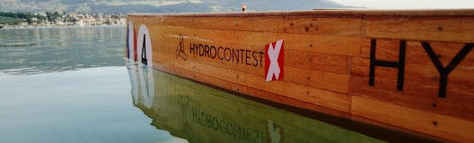
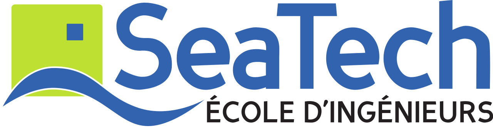

Hydrosharks
===

## Présentation :
Hydrosharks est une association de l'école d'ingénieurs Seatech à Toulon.
Le but est de construire un voiler autonome en mettant à profit notre expérience dans le design de coque et dans la robotique.  

## Git : 

### Serveur :
Code source du futur site internet qui permet de recevoir les informations du bateau. 

### ROS : 
Code source de l'ordinateur de bord, sous ROS. 

#### Navigation :
Algorithme de navigation

#### Routage :
Routage du bateau en fonction de la météo.

### Carte fille :
Code source de la carte électronique.

## Partenaires : 

